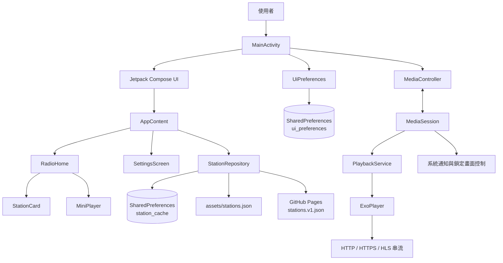
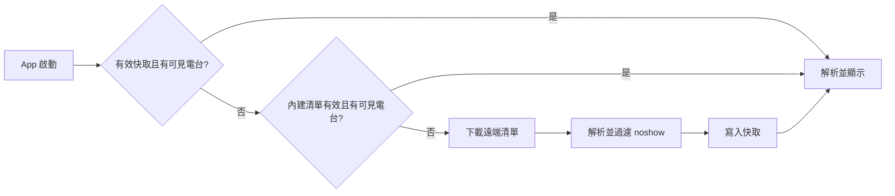

# 系統架構與技術文件

## 1. 架構摘要

mini台灣電台是單模組、單 Activity 的 Android 應用程式。UI 使用 Jetpack Compose，直播播放由 AndroidX Media3、ExoPlayer、MediaSession 與 `MediaSessionService` 負責；電台與 UI 設定使用 `SharedPreferences` 持久化。

目前專案未導入 ViewModel、依賴注入框架、Navigation Compose 或資料庫。狀態主要由 `MainActivity` 與 Composable 持有，適合目前的小型功能範圍。

## 2. 技術棧

| 分類 | 技術 |
|---|---|
| 語言 | Kotlin 2.0.21 |
| UI | Jetpack Compose、Material 3 |
| 播放 | AndroidX Media3 1.5.1、ExoPlayer、MediaSession |
| 非同步 | Kotlin Coroutines |
| 資料格式 | JSON（`org.json`） |
| 本機儲存 | SharedPreferences、APK assets |
| 遠端資料 | GitHub Pages、`HttpURLConnection` |
| Android | minSdk 26、targetSdk 35、compileSdk 35 |

## 3. 元件圖

## 4. 原始碼責任

| 檔案 | 主要責任 |
|---|---|
| `MainActivity.kt` | Activity 生命週期、Compose UI、播放 UI 狀態、設定頁、最愛排序與主題 |
| `PlaybackService.kt` | ExoPlayer、MediaSession、背景播放與服務生命週期 |
| `StationRepository.kt` | 電台資料載入、JSON 解析、快取及最愛 ID 儲存 |
| `Station.kt` | 電台領域資料模型 |
| `UiPreferences.kt` | 顯示模式與主題色持久化 |

## 5. UI 結構與狀態

`MainActivity` 建立 `StationRepository` 與 `UiPreferences`，再以 `setContent` 啟動 Compose。

`AppContent` 持有：

- 是否顯示設定頁。
- 電台清單與初始載入狀態。
- 手動更新進度與結果訊息。

`RadioHome` 持有：

- 最愛 ID 有序清單。
- 拖曳中的電台 ID 與位移。
- LazyColumn 捲動狀態。
- Snackbar 狀態與卡片量測高度。

`PlaybackUiState` 由 MediaController listener 更新，包含目前電台、播放中、緩衝／連線與錯誤狀態。

## 6. 電台資料流

Repository 的執行時優先順序是「快取 → assets → 遠端」。遠端檔案是資料維護的權威來源，但不是每次啟動的第一讀取來源。

手動更新會直接下載遠端資料。下載與解析成功後，完整 JSON 寫入快取，過濾後的可見清單立即更新 UI。

## 7. 播放架構

1. `StationCard` 呼叫 `MainActivity.play(station)`。
2. Activity 先將 UI 設為連線中。
3. Activity 以 explicit Intent 和 `ACTION_PLAY` 啟動 `PlaybackService`。
4. Service 建立 MediaItem，設定電台 ID、串流 URI 與媒體 metadata。
5. ExoPlayer 執行 `prepare()` 與 `play()`。
6. MediaSession 將狀態提供給 MediaController、系統媒體通知及鎖定畫面。
7. Activity 的 Player listener 將狀態轉為 `PlaybackUiState`，驅動卡片與迷你播放器。

切台時沿用同一個 ExoPlayer，以新的 MediaItem 取代舊來源。

## 8. 播放服務生命週期

- Service 建立時初始化 ExoPlayer 與 MediaSession。
- 按 Home 或鎖定螢幕不會停止播放。
- App 內停止會呼叫 player stop、傳送 `ACTION_STOP` 並執行 `stopSelf()`。
- 從最近使用清單移除時，`onTaskRemoved()` 停止播放器與服務。
- Service 銷毀時釋放 MediaSession 與 ExoPlayer。
- Activity 銷毀只釋放 MediaController，不直接停止背景播放。

## 9. 本機儲存

| Preferences | Key | 型別 | 用途 |
|---|---|---|---|
| `station_cache` | `stations_json` | String | 完整遠端 JSON 快取 |
| `station_cache` | `favorite_station_ids` | JSON array String | 最愛 ID 及自訂順序 |
| `ui_preferences` | `display_mode` | String | `system`、`light`、`dark` |
| `ui_preferences` | `theme_color` | Int | ARGB 主題色 |

不會儲存上次播放電台、播放位置或音量。

## 10. 執行緒與非同步

- `StationRepository.load()` 與 `refreshRemote()` 在 `Dispatchers.IO` 執行檔案及網路操作。
- Compose 使用 `rememberCoroutineScope()` 執行初始載入、手動更新、Snackbar 與清單捲動。
- ExoPlayer 與 MediaSession 由 `PlaybackService` 管理。

## 11. 目前架構限制

- UI 與應用邏輯集中在 `MainActivity.kt`，功能擴充後可考慮拆分畫面與 ViewModel。
- Repository 直接建立網路連線，尚未抽象 HTTP client，單元測試較困難。
- 沒有資料庫、快取時間、ETag 或 schema migration。
- Activity 重建後尚未主動從 MediaController 讀取完整既有播放狀態。
- 專案目前沒有自動化測試。
- `PlaybackService` 為 exported，正式發布前應檢視 controller 授權需求。

後續重構應以實際功能需求為前提，避免為小型專案引入不必要的架構層。
