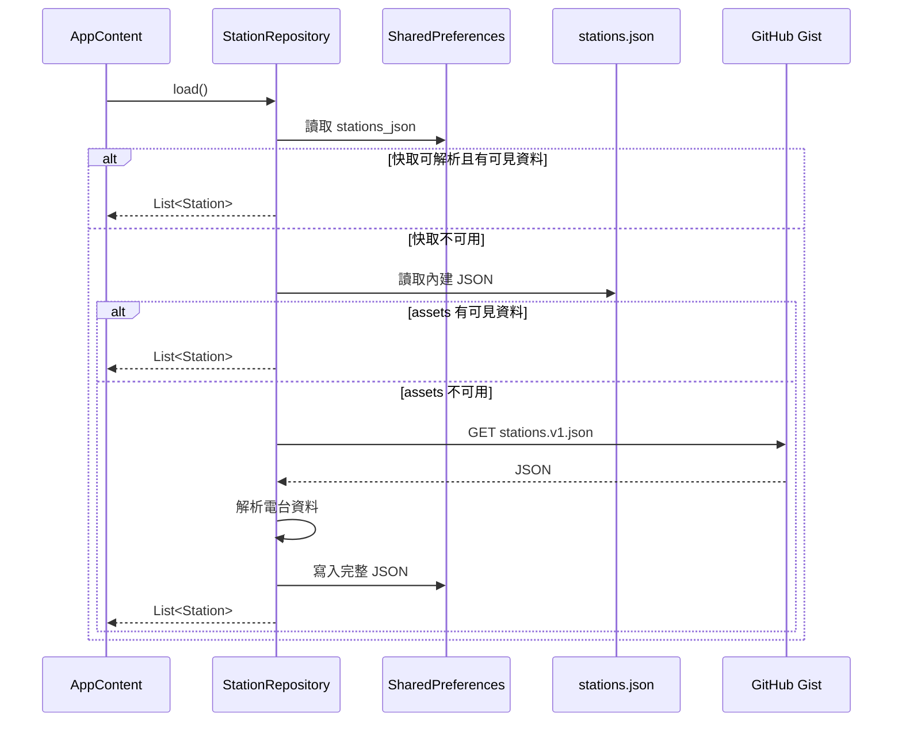
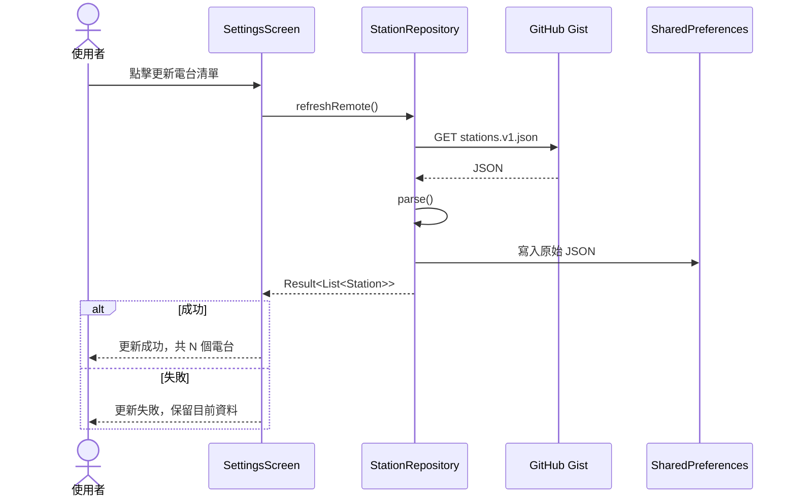
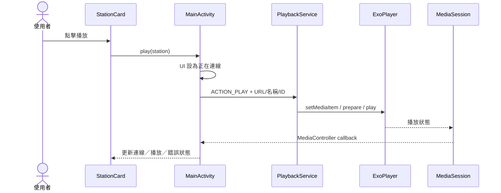

# 系統設計文件

## 1. 目的與範圍

本文件描述 mini台灣電台的系統邊界、功能分解、狀態模型、主要流程與設計決策。產品層級的完整行為以 [`APP_SPEC.md`](APP_SPEC.md) 為準，程式元件細節則參考 [`ARCHITECTURE.md`](ARCHITECTURE.md)。

## 2. 設計目標

- 以最少步驟播放台灣網路電台。
- 在網路不穩時仍能顯示內建或快取的電台資料。
- 支援背景、鎖定畫面及系統媒體控制。
- 讓最愛、排序與外觀設定跨啟動保留。
- 對串流失敗採取可恢復的錯誤處理，不讓 App 閃退。
- 支援 Android 8.0 至目前 target SDK 的裝置。

## 3. 系統邊界

### 系統內部

- Compose 主畫面、設定頁與迷你播放器。
- 電台資料解析及本機快取。
- 最愛與外觀設定。
- MediaSession、播放服務與 ExoPlayer。

### 外部相依

- GitHub Gist 電台 JSON。
- 各電台的 HTTP／HTTPS／HLS 串流伺服器。
- Android 通知、前景服務、媒體控制與系統備份機制。

本系統不管理第三方串流服務的可用性、內容與授權。

## 4. 功能分解

| 子系統 | 輸入 | 輸出 |
|---|---|---|
| 電台目錄 | 快取、assets、遠端 JSON | 可顯示的 `Station` 清單 |
| 清單 UI | Station、最愛與播放狀態 | 卡片、控制按鈕與狀態文字 |
| 最愛管理 | 愛心點擊、拖曳手勢 | 有序 ID、Snackbar、本機儲存 |
| 播放控制 | Station 與停止命令 | MediaItem、播放狀態、錯誤 |
| 背景播放 | MediaSession／Service 生命週期 | 通知、鎖定畫面控制、持續播放 |
| 外觀設定 | 模式、預設色、Hue | Material 3 色彩與系統列樣式 |

## 5. 核心資料模型

### Station

```text
Station
├── id: String
├── name: String
├── network: String
├── frequency: String
├── region: String
├── streamUrl: String
├── websiteUrl: String
├── logoUrl: String
└── enabled: Boolean
```

### PlaybackUiState

```text
PlaybackUiState
├── stationId: String?
├── stationName: String?
├── playing: Boolean
├── buffering: Boolean
├── connecting: Boolean
└── error: String?
```

### 最愛順序

最愛使用有序的 station ID 清單表示。畫面順序為：

```text
有效最愛 ID 對應的電台 + 非最愛電台的原始順序
```

## 6. 清單載入循序



## 7. 手動更新循序



顯示數量 `N` 使用解析後的完整電台清單大小。

## 8. 播放循序



MediaSession 設定指向 `MainActivity` 的 session activity PendingIntent。點擊媒體通知內容時，系統使用 clear-top／single-top flags 開啟或帶回既有 App task；通知控制按鈕仍直接操作播放器。

睡眠定時器由 `PlaybackService` 依 `SystemClock.elapsedRealtime()` 計算結束時間並排程。UI 只設定／取消定時器及格式化剩餘秒數；切台不改變結束時間，停止播放、播放錯誤或服務結束則清除計時。到期後 Service 停止 ExoPlayer 並執行 `stopSelf()`。

## 9. 最愛拖曳設計

- 只有最愛項目註冊長按拖曳手勢。
- 拖曳卡片提高 z-index、放大並增加陰影。
- 量測相鄰卡片實際高度與清單間距，跨越中點時交換。
- 交換時固定 LazyColumn 的數值 index 與 scroll offset，避免第一可見項目的 key 錨定造成清單上移。
- 拖曳期間停用一般清單捲動，避免手勢競爭。
- 第一與最後最愛項目具有位移邊界。
- 每次交換立即儲存新順序。

## 10. 錯誤處理

| 情境 | 行為 |
|---|---|
| 快取損壞 | 忽略快取並嘗試 assets |
| assets 無效 | 嘗試遠端下載 |
| 初始來源全數失敗 | 顯示無法更新或無資料狀態 |
| 手動更新失敗 | 保留目前清單並顯示失敗訊息 |
| 串流播放失敗 | 顯示「串流暫時無法播放」 |
| 最愛 ID 已不存在 | 載入清單後移除無效 ID |

## 11. 非功能需求

### 相容性

- 最低 Android 8.0（API 26）。
- Target SDK 35。
- 支援手勢導覽與傳統導覽列 Insets。

### 效能

- 電台資料量目前很小，以記憶體 List 與 SharedPreferences 足以負荷。
- 網路與檔案讀取在 IO dispatcher 執行。
- 清單使用 LazyColumn 與 stable key。

### 可用性

- 主要操作提供 content description。
- 播放錯誤不造成 App 閃退。
- 可見狀態文字用於回報更新與播放結果。

### 可維護性

- 遠端資料與 APK assets 使用相同 schema。
- 產品、資料、架構與測試文件分離維護。
- 正式發布前需增加自動化測試及串流授權查核。

## 12. 設計決策

| 決策 | 理由 | 代價 |
|---|---|---|
| 單 Activity + Compose | 專案小、狀態與畫面簡單 | `MainActivity.kt` 逐漸集中多項責任 |
| SharedPreferences 快取 JSON | 實作簡單、資料量小 | 缺少查詢、版本與 migration 能力 |
| assets 作為離線備援 | 首次啟動即可顯示清單 | APK 資料可能比遠端舊 |
| MediaSessionService | 支援背景與系統媒體控制 | 必須正確管理前景服務生命週期 |
| 允許 cleartext HTTP | 相容目前候選串流 | 增加傳輸竄改與隱私風險 |
| 不自動恢復播放 | 避免啟動時意外播放 | 使用者需手動重新選台 |

## 13. 未來擴充方向

- 將畫面狀態移入 ViewModel，提升重建與測試能力。
- 抽象資料來源及 HTTP client，增加單元測試與回應驗證。
- 驗證 `schemaVersion`、ID 唯一性及 URL 格式。
- 增加拖曳至視窗邊緣的自動捲動與無障礙排序操作。
- 增加 HTTPS 串流覆蓋率並收斂 cleartext 例外。
- 加入 CI、自動化測試與正式簽署流程。
